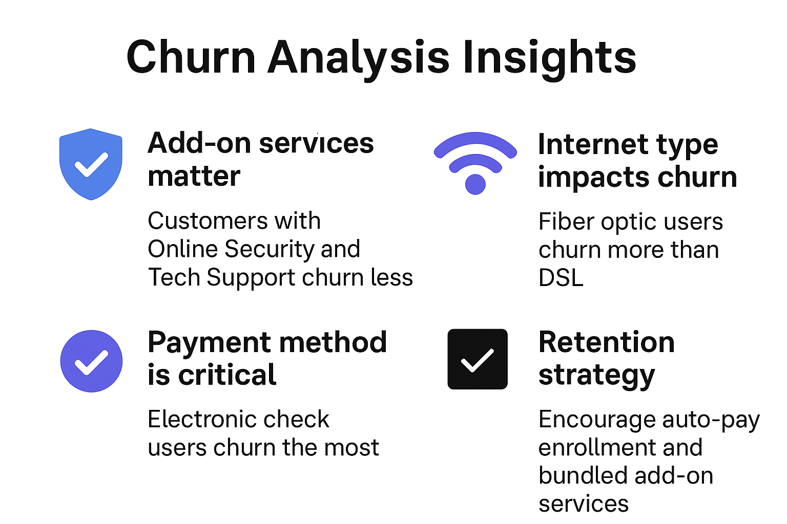

# 📊 Customer Churn Analysis

## 📌 Project Overview
Customer churn is a major challenge for subscription-based businesses. This project analyzes customer behavior to identify key factors that lead to churn and provides actionable insights to improve customer retention.

The analysis is performed using Python and data visualization techniques to uncover patterns and trends in customer data.

---

## 🎯 Objective
- Identify factors affecting customer churn  
- Analyze customer behavior patterns  
- Provide insights to reduce churn rate  

---

## 📂 Dataset Information
The dataset contains **7043 customer records** with 21 features:

### 🔹 Features Included:
- **Customer Info:** Customer ID, Gender, Senior Citizen  
- **Relationship:** Partner, Dependents  
- **Account Info:** Tenure, Contract Type  
- **Services:**  
  - Phone Service  
  - Internet Service  
  - Online Security  
  - Tech Support  
  - Streaming Services  
- **Billing Info:** Monthly Charges, Total Charges  
- **Target Variable:** Churn (Yes/No)

---

## 🛠️ Data Preprocessing
- Converted `TotalCharges` column from object to numeric  
- Handled blank values  
- Converted `SeniorCitizen` from 0/1 to Yes/No  
- Checked for null values and duplicates (none found)  

---

## 📊 Exploratory Data Analysis (EDA)

### 📌 Churn Distribution
- A significant number of customers have churned  
- Helps understand overall churn rate  

---

### 👥 Demographic Analysis
- Senior citizens have a higher churn rate  
- Gender has minimal impact on churn  

---

### ⏳ Tenure Analysis
- Customers with **low tenure (1–2 months)** churn more  
- Long-term customers are more stable  

---

### 📃 Contract Type
- Month-to-month customers → High churn  
- One-year & Two-year contracts → Low churn  

👉 Long-term contracts improve retention  

---

### 🧩 Services Analysis
- Customers without:
  - Online Security  
  - Tech Support  
  - Device Protection  
  → are more likely to churn  

- Fiber optic users churn more than DSL users  

---

### 💳 Payment Method Analysis
- Electronic check → Highest churn  
- Automatic payments → Lowest churn  

👉 Auto-pay users are more loyal  

---

## 🔍 Key Insights
- Lack of security and support services increases churn  
- Short tenure customers are at high risk  
- Month-to-month contracts lead to higher churn  
- Fiber optic users churn more  
- Electronic check users are high-risk customers  

---

## 💡 Business Recommendations
- Promote long-term contracts  
- Encourage auto-payment methods  
- Offer bundled services (security + support)  
- Focus on early customer engagement  
- Improve fiber optic service experience  

---

## 🧰 Tools & Technologies Used
- Python  
- Pandas  
- NumPy  
- Matplotlib  
- Seaborn  

---

## 📸 Project Preview

---

## 🚀 How to Run the Project

```bash
# Clone the repository
git clone https://github.com/your-username/customer-churn-analysis.git

# Navigate to project folder
cd customer-churn-analysis

# Install required libraries
pip install pandas numpy matplotlib seaborn

# Run Jupyter Notebook
jupyter notebook
